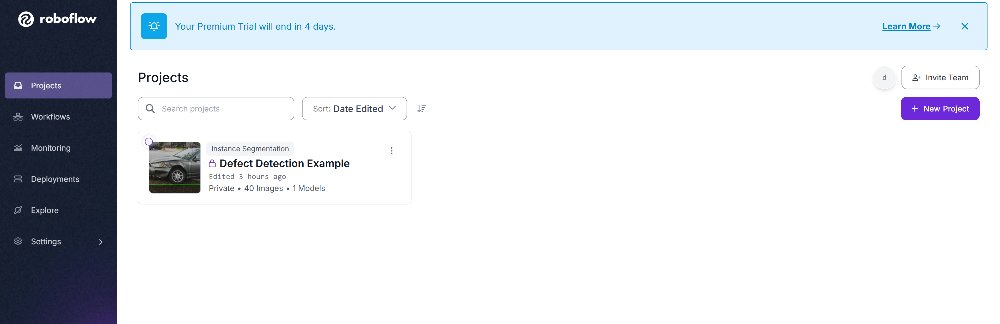
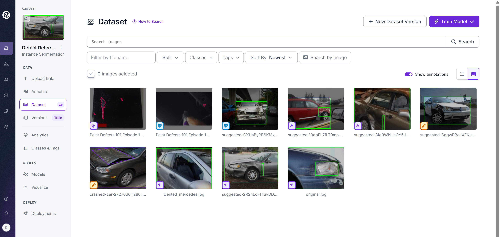
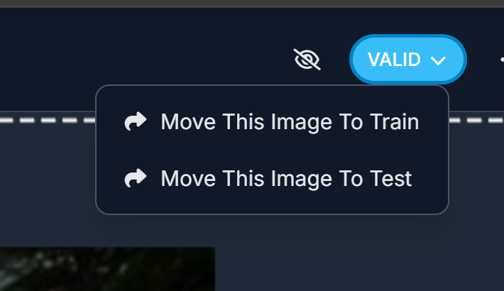
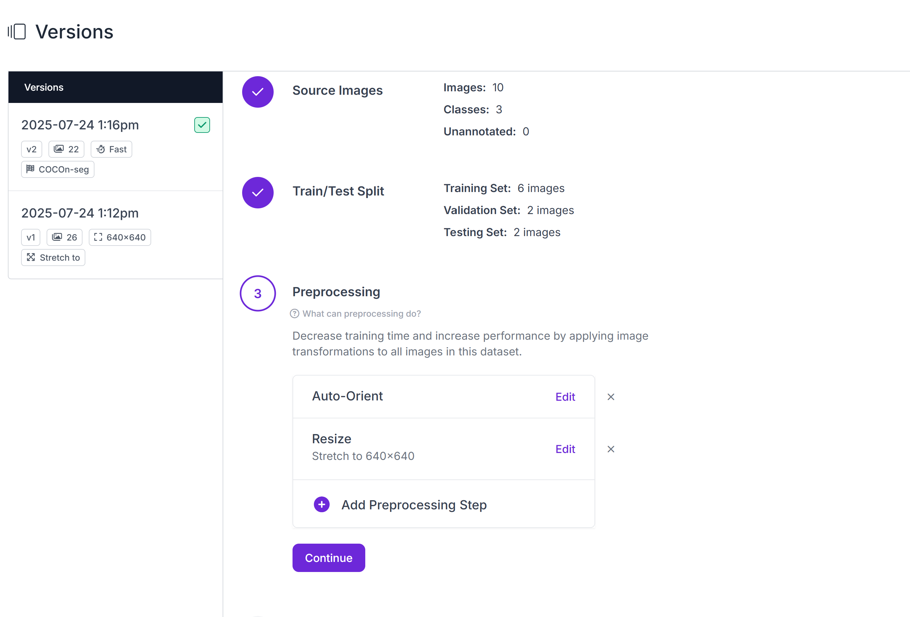

# ML Pipeline SDK

A comprehensive Python toolkit for managing computer vision datasets and models with Roboflow and SharePoint integration. Includes robust CLI tools and scripts for dataset upload/download, bi-directional sync, model inference, video stream processing, data capture, and model training.

## Features
- **Roboflow Integration**: Upload, download, and train models on Roboflow projects.
- **SharePoint Sync**: Bi-directional sync between local folders and SharePoint document libraries.
- **Dataset Management**: Enforce and sync `train/`, `valid/`, and `test/` folder structure.
- **Model Inference**: Run models on single images, folders, or live video streams.
- **Video Data Capture**: Capture frames from a camera directly into dataset folders.
- **End-to-End Pipeline**: Sync, annotate, train, and deploy—all from the command line.

## Requirements
- Python 3.8+
- [roboflow](https://pypi.org/project/roboflow/)
- [Office365-REST-Python-Client](https://pypi.org/project/Office365-REST-Python-Client/)
- [opencv-python](https://pypi.org/project/opencv-python/)
- [supervision](https://pypi.org/project/supervision/) (for video inference)

Install all requirements:
```sh
pip install -r requirements.txt
pip install Office365-REST-Python-Client opencv-python supervision
```

## Quickstart
A minimal end-to-end workflow:

1. **Login to Roboflow and save your credentials**
   ```sh
   python ml_pipeline_cli.py login
   ```
2. **Capture training data from your camera**
   ```sh
   python video_capture.py --output-folder ./dataset --split train --camera 0 --frame-interval 5 --duration 60
   # Repeat for --split valid and --split test as needed
   ```
3. **Upload your images to Roboflow**
   ```sh
   python ml_pipeline_cli.py upload --directory ./dataset/train --split train
   python ml_pipeline_cli.py upload --directory ./dataset/valid --split valid
   python ml_pipeline_cli.py upload --directory ./dataset/test --split test
   ```
4. **Train a model on your dataset**
   ```sh
   python train_model.py --project <project> --workspace <workspace>
   ```
5. **Run inference on a new image**
   ```sh
   python ml_pipeline_cli.py infer --image path/to/image.jpg --model-id <project/version>
   ```
6. **(Optional) Run real-time inference on your camera**
   ```sh
   python video_infer.py --model-id <project/version>
   ```

## Authentication
### Roboflow
Run the login command to securely store your API key and (optionally) default project/workspace:
```sh
python ml_pipeline_cli.py login
```
Or set environment variables:
```sh
export ROBOFLOW_API_KEY="your_api_key"
export ROBOFLOW_PROJECT="your_project"
export ROBOFLOW_WORKSPACE="your_workspace"
```

### SharePoint
You can authenticate with either username/password or Azure AD App credentials (client ID/secret). Pass these as CLI arguments to sync commands.

## CLI Usage
Run `python ml_pipeline_cli.py --help` for all options.

### Upload Images to Roboflow
```sh
python ml_pipeline_cli.py upload --image path/to/image.jpg --project <project> --workspace <workspace> --api-key <key>
python ml_pipeline_cli.py upload --directory path/to/images --split train --project <project> --workspace <workspace> --api-key <key>
```

### Download Dataset from Roboflow
```sh
python ml_pipeline_cli.py download --output-dir ./data --format yolov8 --version 1 --project <project> --workspace <workspace> --api-key <key>
```

### Run Model Inference
```sh
python ml_pipeline_cli.py infer --image path/to/image.jpg --model-id <project/version> --api-key <key>
python ml_pipeline_cli.py infer --directory path/to/images --model-id <project/version> --api-key <key>
```

### Sync Local Folder with SharePoint
```sh
python ml_pipeline_cli.py sync --sharepoint-site <site_url> --sharepoint-folder "Shared Documents/Folder" --local-folder ./data/train --direction both --username <user> --password <pass>
```
- Use `--direction to-local` or `--direction to-sharepoint` for one-way sync.
- You can use `--client-id` and `--client-secret` for Azure AD App authentication.

### Sync All (Local, SharePoint, Roboflow)
```sh
python ml_pipeline_cli.py sync-all --local-root ./data --sharepoint-site <site_url> --sharepoint-folder "Shared Documents/Dataset" --project <project> --workspace <workspace> --api-key <key> --username <user> --password <pass>
```
- This will sync `train/`, `valid/`, and `test/` folders across all three locations.

### Train a Model on Roboflow
```sh
python train_model.py --api-key <key> --project <project> --workspace <workspace> --model-type yolov8 --epochs 50 --batch-size 16
```
- Monitors training status and prints results.

### Video Stream Inference
```sh
python video_infer.py --model-id <project/version> --api-key <key> --camera 0 --confidence 0.4 --output output.mp4
```
- Runs real-time inference on your camera stream and displays annotated results.
- Press `q` to quit.

### Video Data Capture
```sh
python video_capture.py --output-folder ./dataset --split train --camera 0 --frame-interval 5 --duration 60
```
- Saves every 5th frame from the camera to `./dataset/train/` for 60 seconds (or until you press `q`).

## Dataset Structure
All dataset operations expect the following structure:
```
<root>/
  train/
  valid/
  test/
```

## Troubleshooting
- **Authentication errors**: Double-check your API key, project/workspace names, and SharePoint credentials.
- **Missing dependencies**: Install all required packages as shown above.
- **SharePoint sync issues**: Ensure your account/app has permissions for the target site/library.
- **Video errors**: Make sure your camera is connected and accessible by OpenCV.

## Annotating Data
In Roboflow:
select or create a project on the project page



Upload data

Annotate by either using the AI assist feature (good at recognizing shapes that contract the background) or use the polygon tool to select and label regions



Make sure to leave some images for Validation and Testing



Train the model, augmentation can increase the dataset by making minor modifications



You are now ready to use the model for inference!

## Contributing
Pull requests and feature suggestions are welcome!

## License
MIT License
